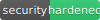
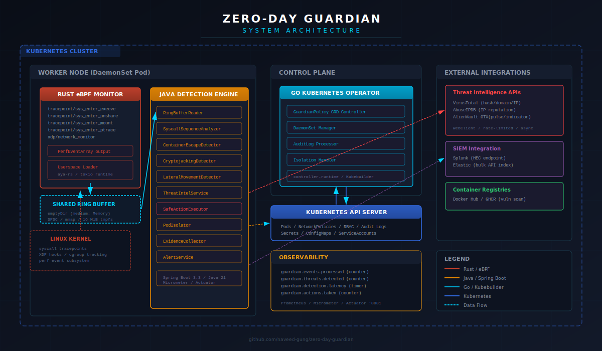
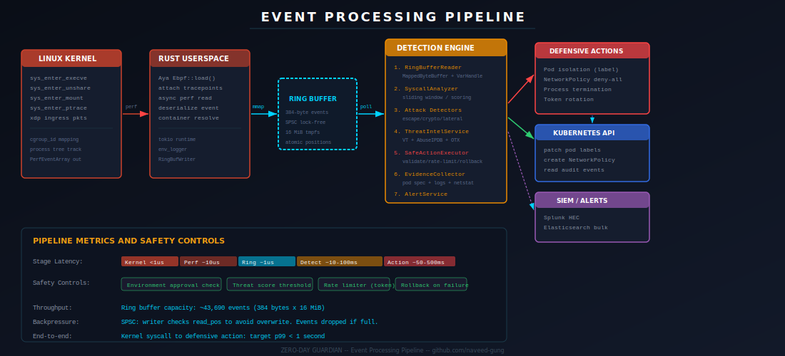

<p align="center">
  
</p>

<h1 align="center">ZERO-DAY GUARDIAN</h1>

<p align="center">
  <strong>Production Kubernetes Security Monitoring System</strong><br/>
  Real-time container threat detection, automated defense, and forensic evidence collection.
</p>

<p align="center">
  
  
  
</p>

<p align="center">
  <code>Rust (Aya-rs)</code> &middot; <code>Java 21 (Spring Boot 3.3)</code> &middot; <code>Go (Kubebuilder)</code>
</p>

---

## Overview

Zero-Day Guardian is a production-grade security monitoring system that deploys directly into a Kubernetes cluster to monitor real containers, detect real attacks, and take real defensive actions. It is a **headless, infrastructure-level system** -- there is no web UI or dashboard. All interaction is through Kubernetes CRDs, kubectl, metrics endpoints, and SIEM integrations.

The system combines three purpose-built components across three languages:

| Component            | Language             | Purpose                                                                                                     |
| -------------------- | -------------------- | ----------------------------------------------------------------------------------------------------------- |
| **eBPF Node Agent**  | Rust (Aya-rs)        | Hooks kernel syscalls, captures container activity via eBPF tracepoints and XDP                             |
| **Detection Engine** | Java (Spring Boot 3) | Analyzes event streams, detects attack patterns, integrates threat intelligence, executes defensive actions |
| **Cluster Operator** | Go (Kubebuilder)     | Manages CRD-based security policies, orchestrates DaemonSet deployment, handles cluster-wide remediation    |

All components are production-ready, using real APIs and real Kubernetes integration.

Zero-Day Guardian is designed as an **infrastructure-level security primitive**, not an end-user application. It follows the same operational model as other Kubernetes-native security tools (Falco, Cilium, Tetragon):

- **Configuration** is declarative via the `GuardianPolicy` CRD (kubectl / GitOps)
- **Observability** is through Prometheus metrics (`/actuator/prometheus` on port 8081)
- **Alerting** is through SIEM integration (Splunk HEC, Elasticsearch) and Kubernetes events
- **Forensics** are collected as structured JSON and pushed to configured SIEM targets
- **Status** is visible via `kubectl get guardianpolicies` and standard pod logs

Any existing Kubernetes dashboard (Grafana, Lens, K9s) or SIEM console (Splunk, Kibana) serves as the visualization layer.

<p align="center">
  
</p>

---

## Architecture

### Data Flow

```
Linux Kernel (syscalls / XDP)
    |
    | eBPF tracepoints + PerfEventArray
    v
Rust Userspace Loader (Aya-rs / tokio)
    |
    | Shared memory-mapped SPSC ring buffer (tmpfs)
    v
Java Detection Engine (Spring Boot 3)
    |
    |--- Attack Pattern Analysis
    |      |--- Container escape detection (CVE-2019-5736 patterns)
    |      |--- Cryptojacking detection (CPU + mining pool correlation)
    |      |--- Lateral movement detection (K8s API abuse)
    |      |--- Syscall sequence analysis (sliding window scoring)
    |
    |--- Threat Intelligence Enrichment
    |      |--- VirusTotal (file hashes, domains, IPs)
    |      |--- AbuseIPDB (IP reputation scoring)
    |      |--- AlienVault OTX (threat context, indicators)
    |
    |--- Safety-Gated Action Executor
    |      |--- Environment approval check
    |      |--- Threat score validation
    |      |--- Rate limiting (configurable per minute)
    |      |--- Automatic rollback on failure
    |
    v
Defensive Actions via Kubernetes API
    |--- Pod isolation (labels + NetworkPolicy deny-all)
    |--- Process termination (SIGKILL via container runtime)
    |--- Service account token rotation
    |--- Forensic evidence collection (pod spec, logs, network state)
    |--- SIEM alerting (Splunk HEC / Elasticsearch)
```

<p align="center">
  
</p>

### Shared Event Format

The eBPF monitor and detection engine communicate through a binary ring buffer protocol. Each event is a 384-byte fixed-size `GuardianEvent` struct written to a memory-mapped file on tmpfs. See [proto/events.md](proto/events.md) for the full wire format specification.

---

## Components

### Rust eBPF Monitor (`ebpf-monitor/`)

Deploys as a privileged DaemonSet container on every cluster node. Loads eBPF programs into the kernel to:

- **Trace syscalls**: `execve`, `unshare`, `mount`, `ptrace`, `init_module`, `finit_module` via kernel tracepoints
- **Monitor network**: XDP program inspects ingress packets for C2, DNS tunneling (port 53 + size heuristic), mining pool traffic
- **Track containers**: Maps cgroup IDs to container/pod identities
- **Publish events**: Writes 384-byte binary events to a shared SPSC ring buffer on tmpfs

**Stack**: Aya-rs 0.13, tokio async runtime, `#[no_std]` BPF target programs, zero C dependencies

```
ebpf-monitor/
  ebpf-monitor-ebpf/       eBPF kernel programs (#[no_std], bpfel-unknown-none target)
    src/main.rs             Tracepoint + XDP program entry points
  ebpf-monitor-common/     Shared types between kernel and userspace (#[repr(C)])
    src/lib.rs              GuardianEvent struct, EventType enum
  ebpf-monitor/            Userspace loader and ring buffer writer
    src/main.rs             Aya program loader, ring buffer publisher
  Cargo.toml               Workspace root manifest
  Dockerfile               Multi-stage build (rust:nightly -> debian:bookworm-slim)
```

### Java Detection Engine (`detection-engine/`)

Runs as a sidecar in the same DaemonSet pod. Consumes events from the shared ring buffer and:

- **Analyzes syscall sequences** with sliding window scoring against known attack patterns
- **Detects container escapes** (CVE-2019-5736 patterns, namespace breaking, kernel module loading)
- **Detects cryptojacking** (CPU anomaly + mining pool network correlation)
- **Detects lateral movement** (K8s API abuse, service account token misuse, RBAC manipulation)
- **Monitors Pod Security Standards** (privileged containers, hostPath, dangerous capabilities including NET_RAW)
- **Maps to MITRE ATT&CK** (T1611, T1496, T1046, T1021, T1528, T1572, T1055, T1613, T1552.005)
- **Queries threat intelligence** (VirusTotal, AbuseIPDB, AlienVault OTX) for enrichment
- **Executes defensive actions** through a safety-gated executor with rate limiting and rollback
- **Terminates malicious processes** (SIGKILL via Kubernetes exec API for critical escape detections)
- **Rotates service account tokens** when compromise is detected
- **Monitors audit logs** for exec, attach, and portforward operations

**Stack**: Spring Boot 3.3.6, Java 21, Kubernetes Java Client 21.0.2, Micrometer/Prometheus, Gradle 8.9

```
detection-engine/
  src/main/java/com/zerodayguardian/detector/
    DetectorApplication.java            Spring Boot entry point
    config/
      KubernetesConfig.java             K8s client bean configuration
      RingBufferConfig.java             Ring buffer reader configuration
      ThreatIntelConfig.java            Threat intel client configuration
    event/
      SyscallEvent.java                 Binary event deserialization (384 bytes)
      EventType.java                    Event type enum mapping
      RingBufferReader.java             Memory-mapped ring buffer consumer
    detection/
      AttackDetector.java               Orchestrates all detection strategies
      ContainerEscapeDetector.java      CVE-2019-5736, namespace escape patterns
      CryptojackingDetector.java        CPU anomaly + mining pool correlation
      LateralMovementDetector.java      K8s API abuse, token misuse detection
      SyscallSequenceAnalyzer.java      Sliding window syscall pattern scoring
      DetectionResult.java              Detection outcome with threat score
    action/
      SafeActionExecutor.java           Safety-gated action dispatcher
      ActionTracker.java                Rate limiting and audit trail
      PodIsolator.java                  Pod label + NetworkPolicy isolation
      NetworkBlocker.java               Network deny-all policy creation
      ProcessKiller.java                Process termination via K8s exec API
    threatintel/
      ThreatIntelService.java           Aggregated threat intel query service
      VirusTotalClient.java             VirusTotal v3 API client
      AbuseIPDBClient.java              AbuseIPDB v2 API client
      AlienVaultOTXClient.java          OTX DirectConnect API client
      ThreatIntelResult.java            Unified threat intel response model
    kubernetes/
      AuditLogProcessor.java            K8s audit log stream processing
      PodSecurityMonitor.java           Runtime PSA violation detection
      ServiceAccountWatcher.java        Service account tracking and token rotation
    alert/
      AlertService.java                 Alert routing and formatting
      AlertPayload.java                 Structured alert payload model
      SplunkIntegration.java            Splunk HEC forwarder
      ElasticIntegration.java           Elasticsearch indexer
    forensic/
      EvidenceCollector.java            Forensic evidence capture (pod spec, logs, network)
    metrics/
      GuardianMetrics.java              Prometheus metric definitions
  src/test/java/com/zerodayguardian/detector/
    action/ActionTrackerTest.java       Rate limiting and tracking tests
    detection/
      ContainerEscapeDetectorTest.java  Escape pattern detection tests
      CryptojackingDetectorTest.java    Mining detection tests
    event/SyscallEventTest.java         Binary event parsing tests
  build.gradle.kts                      Gradle Kotlin DSL build configuration
  Dockerfile                            Multi-stage build (gradle -> eclipse-temurin:21-jre)
```

### Go Kubernetes Operator (`guardian-operator/`)

Runs as a Deployment in the cluster control plane. Manages:

- **GuardianPolicy CRD**: Declarative security policy configuration with validation
- **DaemonSet lifecycle**: Ensures node agents are deployed with correct configuration, volumes, and security contexts
- **Owner references**: Automatic garbage collection when policies are deleted
- **Finalizer-based cleanup**: Graceful resource deletion on policy removal
- **Status reporting**: Monitored node count, phase, and condition updates

**Stack**: Kubebuilder, controller-runtime v0.18.4, Go 1.22+, Kubernetes API v0.30.1

```
guardian-operator/
  api/v1alpha1/
    types.go                  GuardianPolicy CRD type definitions
    groupversion_info.go      API group/version registration
    zz_generated.deepcopy.go  Generated deep copy methods
  internal/controller/
    guardianpolicy_controller.go       Main reconciliation loop
    guardianpolicy_controller_test.go  Reconciler unit tests (5 tests)
    daemonset_manager.go               DaemonSet build and lifecycle management
  cmd/
    main.go                   Operator entry point, manager setup
  Dockerfile                  Multi-stage build (golang -> gcr.io/distroless/static)
  Makefile                    Standard Kubebuilder targets
  go.mod / go.sum             Go module definition
```

---

## GuardianPolicy CRD

All security configuration is managed through the `GuardianPolicy` custom resource:

```yaml
apiVersion: guardian.zerodayguardian.io/v1alpha1
kind: GuardianPolicy
metadata:
  name: default-policy
  namespace: guardian-system
spec:
  # Target specific nodes
  nodeSelector:
    kubernetes.io/os: linux

  # Detection configuration
  detection:
    enabled: true
    severityThreshold: HIGH # CRITICAL | HIGH | MEDIUM | LOW | INFO
    enabledDetectors:
      - container-escape
      - cryptojacking
      - lateral-movement
      - sequence-analysis

  # Automated response configuration
  response:
    dryRun: false # Set true to log without acting
    rateLimitPerMinute: 10 # Max actions per target per minute
    excludedNamespaces: # Always protected from automated actions
      - kube-system
      - kube-public
      - kube-node-lease

  # Threat intelligence (optional)
  threatIntel:
    virusTotalSecretRef:
      name: guardian-secrets
      key: virustotal-api-key
    abuseIPDBSecretRef:
      name: guardian-secrets
      key: abuseipdb-api-key
    otxSecretRef:
      name: guardian-secrets
      key: otx-api-key

  # SIEM forwarding (optional)
  siem:
    splunk:
      enabled: true
      hecUrl: "https://splunk.example.com:8088/services/collector"
      tokenRef:
        name: guardian-secrets
        key: splunk-hec-token
    elastic:
      enabled: true
      url: "https://elasticsearch.example.com:9200"
      apiKeyRef:
        name: guardian-secrets
        key: elastic-api-key
```

Check status with:

```bash
kubectl get guardianpolicies -n guardian-system
kubectl describe guardianpolicy default-policy -n guardian-system
```

A sample resource is provided at [deploy/examples/guardianpolicy-sample.yaml](deploy/examples/guardianpolicy-sample.yaml).

---

## Prerequisites

| Requirement     | Minimum Version | Notes                           |
| --------------- | --------------- | ------------------------------- |
| Kubernetes      | 1.28+           | With RBAC enabled               |
| Linux Kernel    | 5.15+           | eBPF CO-RE support required     |
| Rust            | Nightly         | For eBPF BPF target compilation |
| Java            | 21 (LTS)        | Detection engine runtime        |
| Go              | 1.22+           | Operator compilation            |
| Docker / Podman | 24+             | Container image builds          |
| kubectl         | 1.28+           | Cluster interaction             |
| kustomize       | 5.0+            | Manifest overlay rendering      |
| bpf-linker      | Latest          | `cargo install bpf-linker`      |

---

## Quick Start

### 1. Configure Secrets

```bash
kubectl create namespace guardian-system

kubectl create secret generic guardian-secrets \
  --namespace guardian-system \
  --from-literal=virustotal-api-key='YOUR_VT_KEY' \
  --from-literal=abuseipdb-api-key='YOUR_ABUSEIPDB_KEY' \
  --from-literal=otx-api-key='YOUR_OTX_KEY' \
  --from-literal=splunk-hec-token='YOUR_SPLUNK_TOKEN' \
  --from-literal=elastic-api-key='YOUR_ELASTIC_KEY'
```

### 2. Build Container Images

```bash
# Build all three component images
./scripts/build-all.sh
```

Or build individually:

```bash
# Rust eBPF Monitor
cd ebpf-monitor && docker build -t ghcr.io/<owner>/zero-day-guardian/ebpf-monitor:latest .

# Java Detection Engine
cd detection-engine && docker build -t ghcr.io/<owner>/zero-day-guardian/detection-engine:latest .

# Go Operator
cd guardian-operator && docker build -t ghcr.io/<owner>/zero-day-guardian/operator:latest .
```

### 3. Deploy to Cluster

```bash
# Development (relaxed resource limits, debug logging)
./scripts/deploy.sh dev

# Production (tuned resources, INFO logging)
./scripts/deploy.sh prod
```

Or deploy manually with kustomize:

```bash
# Development
kubectl apply -k deploy/overlays/dev

# Production
kubectl apply -k deploy/overlays/prod
```

### 4. Apply a Security Policy

```bash
kubectl apply -f deploy/examples/guardianpolicy-sample.yaml
```

### 5. Validate Deployment

```bash
# Run validation checks
./scripts/validate-cluster.sh

# Check operator status
kubectl get pods -n guardian-system
kubectl get guardianpolicies -n guardian-system

# Watch detection engine logs
kubectl logs -n guardian-system -l app.kubernetes.io/name=zero-day-guardian -c detection-engine -f

# Watch eBPF monitor logs
kubectl logs -n guardian-system -l app.kubernetes.io/name=zero-day-guardian -c ebpf-monitor -f
```

### 6. Test Detection (Non-Production Only)

```bash
# Simulates attack patterns in an isolated test namespace
./scripts/test-attack.sh
```

---

## Configuration

### Environment Variables

All configuration is managed through environment variables and Kubernetes ConfigMaps / Secrets.

| Variable                 | Description                                 | Default                      |
| ------------------------ | ------------------------------------------- | ---------------------------- |
| `RING_BUFFER_PATH`       | Path to shared ring buffer file             | `/shared/ringbuf/events.buf` |
| `RING_BUFFER_SIZE_MB`    | Ring buffer size in MiB                     | `16`                         |
| `THREAT_SCORE_THRESHOLD` | Minimum score to trigger automated action   | `75`                         |
| `RATE_LIMIT_PER_MINUTE`  | Max defensive actions per target per minute | `5`                          |
| `APPROVED_NAMESPACES`    | Namespaces where actions are allowed        | `default`                    |
| `LOG_LEVEL`              | Logging level                               | `INFO`                       |
| `XDP_INTERFACE`          | Network interface for XDP program           | `eth0`                       |
| `VIRUSTOTAL_API_KEY`     | VirusTotal API key                          | (required)                   |
| `ABUSEIPDB_API_KEY`      | AbuseIPDB API key                           | (required)                   |
| `OTX_API_KEY`            | AlienVault OTX API key                      | (required)                   |
| `SPLUNK_HEC_URL`         | Splunk HTTP Event Collector URL             | (optional)                   |
| `SPLUNK_HEC_TOKEN`       | Splunk HEC token                            | (optional)                   |
| `ELASTIC_HOSTS`          | Elasticsearch hosts (comma-separated)       | (optional)                   |

### Kustomize Overlays

| Overlay  | Path                    | Description                                                     |
| -------- | ----------------------- | --------------------------------------------------------------- |
| **dev**  | `deploy/overlays/dev/`  | Debug logging, relaxed resource limits, single replica operator |
| **prod** | `deploy/overlays/prod/` | INFO logging, tuned resource limits, production-grade settings  |

---

## Kubernetes Manifests

All deployment manifests live under `deploy/`:

```
deploy/
  base/
    namespace.yaml                 guardian-system namespace
    serviceaccount.yaml            guardian-monitor and operator service accounts
    clusterrole.yaml               RBAC permissions (eBPF, pod management, secrets)
    clusterrolebinding.yaml        Binds ClusterRole to service accounts
    configmap.yaml                 Shared configuration (ring buffer path, thresholds)
    secrets.yaml                   Secret template for API keys
    daemonset.yaml                 eBPF monitor + detection engine DaemonSet
    operator-deployment.yaml       Guardian operator Deployment
    networkpolicy-isolation.yaml   Template NetworkPolicy for pod isolation
    crd/                           GuardianPolicy CustomResourceDefinition
    kustomization.yaml             Base kustomization
  overlays/
    dev/                           Development environment patches
    prod/                          Production environment patches
  examples/
    guardianpolicy-sample.yaml     Example GuardianPolicy resource
```

---

## Detection Capabilities

### Container Escape Detection

Identifies real container escape attempts by analyzing syscall sequences for patterns matching known CVEs (CVE-2019-5736 and variants). Monitors for:

- `unshare()` + `mount()` combinations indicating namespace escape
- Kernel module loading attempts from container contexts
- Host filesystem access via `/proc/self/exe` manipulation
- Privilege escalation through capability abuse

### Cryptojacking Detection

Correlates CPU usage anomalies with network behavior to identify cryptocurrency mining:

- Sustained high CPU with low I/O wait (compute-bound pattern)
- Outbound connections to known mining pool IPs and domains
- Stratum protocol detection in network traffic
- Cross-references IPs against threat intelligence feeds

### Lateral Movement Detection

Monitors Kubernetes API activity for signs of cluster compromise:

- Suspicious `pods/exec` and `pods/portforward` calls
- Service account token access from unexpected pods
- RBAC manipulation (ClusterRole/ClusterRoleBinding changes)
- Secret enumeration across namespaces
- Pod creation with privileged security contexts

### Syscall Sequence Analysis

Sliding-window pattern matching across system call streams:

- Scores sequences against known attack fingerprints
- Configurable severity thresholds (CRITICAL, HIGH, MEDIUM, LOW, INFO)
- Time-decay weighting for temporal correlation
- MITRE ATT&CK technique mapping for detected patterns

---

## Defensive Actions

All automated actions pass through the `SafeActionExecutor` which enforces:

1. **Environment approval** -- verifies the target namespace is in the approved list
2. **Threat validation** -- confirms the threat score exceeds the configured threshold
3. **Rate limiting** -- caps actions per target per minute to prevent cascading failures
4. **Dry-run mode** -- logs intended actions without executing (configurable via CRD)
5. **Automatic rollback** -- reverts partial actions on failure

| Action                  | Description                                                                             | Reversible |
| ----------------------- | --------------------------------------------------------------------------------------- | ---------- |
| **Pod Isolation**       | Adds `security.zerodayguardian.io/isolated: true` label, applies deny-all NetworkPolicy | Yes        |
| **Process Termination** | Sends SIGKILL to offending process via container runtime                                | No         |
| **Token Rotation**      | Rotates compromised service account tokens                                              | Yes        |
| **Forensic Collection** | Captures pod spec, container logs, network state as structured JSON                     | N/A        |
| **SIEM Alert**          | Forwards structured alert payload to Splunk HEC and/or Elasticsearch                    | N/A        |

---

## Metrics

Exposed via Prometheus-compatible `/actuator/prometheus` endpoint on port 8081:

| Metric                               | Type      | Description                          |
| ------------------------------------ | --------- | ------------------------------------ |
| `guardian_events_processed_total`    | Counter   | Total syscall events processed       |
| `guardian_threats_detected_total`    | Counter   | Threats detected (by type/severity)  |
| `guardian_detection_latency_seconds` | Histogram | Time from event to detection         |
| `guardian_actions_taken_total`       | Counter   | Defensive actions executed (by type) |
| `guardian_actions_failed_total`      | Counter   | Failed defensive actions             |
| `guardian_ring_buffer_utilization`   | Gauge     | Ring buffer usage percentage         |

Example Prometheus scrape config:

```yaml
scrape_configs:
  - job_name: "zero-day-guardian"
    kubernetes_sd_configs:
      - role: pod
        namespaces:
          names: ["guardian-system"]
    relabel_configs:
      - source_labels: [__meta_kubernetes_pod_label_app_kubernetes_io_name]
        regex: zero-day-guardian
        action: keep
```

---

## CI/CD

GitHub Actions workflows are provided in `.github/workflows/`:

| Workflow                                     | Trigger                                 | Description                                                                  |
| -------------------------------------------- | --------------------------------------- | ---------------------------------------------------------------------------- |
| [ci.yml](.github/workflows/ci.yml)           | Push to `main`/`develop`, PRs to `main` | Builds and tests all three components, runs linters, builds container images |
| [release.yml](.github/workflows/release.yml) | Git tag `v*`                            | Builds production images, pushes to GHCR, creates GitHub Release             |

### CI Pipeline Stages

1. **Rust** -- `cargo fmt --check`, `cargo clippy`, `cargo test`, Docker image build
2. **Java** -- `gradle build` (compile + 19 unit tests), Docker image build
3. **Go** -- `go vet`, `go test` (5 unit tests), Docker image build
4. **Integration** -- Validates kustomize overlays can render

---

## Testing

### Unit Tests

```bash
# Java Detection Engine (19 tests)
cd detection-engine && ./gradlew test

# Go Operator (5 tests)
cd guardian-operator && go test ./... -v

# Rust eBPF Monitor (requires nightly + bpf-linker)
cd ebpf-monitor && cargo test
```

### Attack Simulation

The `test-attack.sh` script deploys a test namespace with controlled attack simulations:

```bash
./scripts/test-attack.sh
```

This creates isolated test pods that trigger each detection pattern and verifies the system responds correctly. Only run this in non-production clusters.

---

## Security Considerations

This system requires elevated privileges by design. See [docs/security-considerations.md](docs/security-considerations.md) for detailed rationale.

**Key points:**

- The eBPF monitor container runs as privileged with `BPF`, `SYS_ADMIN`, and `NET_ADMIN` capabilities
- `hostPID` and `hostNetwork` are required for full system call and network visibility
- All defensive actions pass through the `SafeActionExecutor` with environment approval, threat validation, rate limiting, and automatic rollback
- The `kube-system`, `kube-public`, and `kube-node-lease` namespaces are excluded from all automated actions by default
- All actions are logged with full audit trail for forensic review
- Service account permissions follow least-privilege principles per component

---

## Project Structure

```
ZERO-DAY GUARDIAN/
  ebpf-monitor/                Rust eBPF node agent (Aya-rs 0.13)
    ebpf-monitor-ebpf/           BPF kernel programs (#[no_std])
    ebpf-monitor-common/         Shared event structs (#[repr(C)])
    ebpf-monitor/                Userspace loader + ring buffer writer
    Cargo.toml                   Workspace manifest
    Dockerfile
  detection-engine/            Java detection engine (Spring Boot 3.3.6)
    src/main/java/.../
      config/                    Spring configuration beans
      event/                     Ring buffer reader + event types
      detection/                 Attack pattern detectors
      action/                    Safety-gated defensive action executors
      threatintel/               Threat intelligence API clients
      kubernetes/                K8s API integration (audit, PSA, SA)
      alert/                     SIEM integration (Splunk / Elasticsearch)
      forensic/                  Evidence collection
      metrics/                   Prometheus metric definitions
    src/test/java/.../           Unit tests (19 tests)
    build.gradle.kts             Gradle Kotlin DSL build
    Dockerfile
  guardian-operator/           Go Kubernetes operator (Kubebuilder)
    api/v1alpha1/                GuardianPolicy CRD types + deepcopy
    internal/controller/         Reconciler + DaemonSet manager
    cmd/                         Operator entry point
    Makefile                     Kubebuilder targets
    Dockerfile
  deploy/                      Kubernetes deployment manifests
    base/                        Base Kustomize resources + CRD
    overlays/dev/                Development overlay
    overlays/prod/               Production overlay
    examples/                    Sample GuardianPolicy resource
  proto/                       Shared protocol documentation
    events.md                    Binary event wire format spec
  assets/                      SVG diagrams and visual assets
  docs/                        Architecture and deployment documentation
    architecture.md
    deployment-guide.md
    security-considerations.md
  scripts/                     Build, deploy, and test scripts
    build-all.sh
    deploy.sh
    test-attack.sh
    validate-cluster.sh
  .github/workflows/           CI/CD pipelines
    ci.yml                       Continuous integration
    release.yml                  Release and image publishing
  LICENSE                      Apache License 2.0
  README.md
```

---

## Troubleshooting

### eBPF Monitor Won't Start

- Verify kernel version is 5.15+ (`uname -r`)
- Ensure the node has BTF (BPF Type Format) enabled: `ls /sys/kernel/btf/vmlinux`
- Check that the container is running as privileged with correct capabilities

### Detection Engine Not Processing Events

- Verify the ring buffer tmpfs volume is mounted at the correct path in both containers
- Check `RING_BUFFER_PATH` matches between the eBPF monitor and detection engine
- Look for `RingBufferReader` initialization logs: `kubectl logs <pod> -c detection-engine | grep RingBuffer`

### Operator Not Reconciling

- Ensure the CRD is installed: `kubectl get crd guardianpolicies.guardian.zerodayguardian.io`
- Check operator logs: `kubectl logs -n guardian-system -l app=guardian-operator`
- Verify RBAC permissions: `kubectl auth can-i list pods --as=system:serviceaccount:guardian-system:guardian-operator`

### Actions Not Firing

- Check if `dryRun: true` is set in the GuardianPolicy spec
- Verify the target namespace is not in `excludedNamespaces`
- Check rate limiting: `guardian_actions_failed_total` metric with reason label
- Review `SafeActionExecutor` logs for approval/rejection decisions

---

## Documentation

| Document                                                                                 | Description                                       |
| ---------------------------------------------------------------------------------------- | ------------------------------------------------- |
| [docs/architecture.md](docs/architecture.md)                                             | Detailed system architecture and design decisions |
| [docs/deployment-guide.md](docs/deployment-guide.md)                                     | Step-by-step deployment instructions              |
| [docs/security-considerations.md](docs/security-considerations.md)                       | Security model, privilege rationale, threat model |
| [proto/events.md](proto/events.md)                                                       | Binary event wire format specification            |
| [deploy/examples/guardianpolicy-sample.yaml](deploy/examples/guardianpolicy-sample.yaml) | Example CRD configuration                         |

---

## License

This project is licensed under the Apache License 2.0. See [LICENSE](LICENSE) for details.

---

## Author

**Naveed Gung**

- GitHub: [naveed-gung](https://github.com/naveed-gung)
- Portfolio: [naveed-gung.dev](https://naveed-gung.dev)
